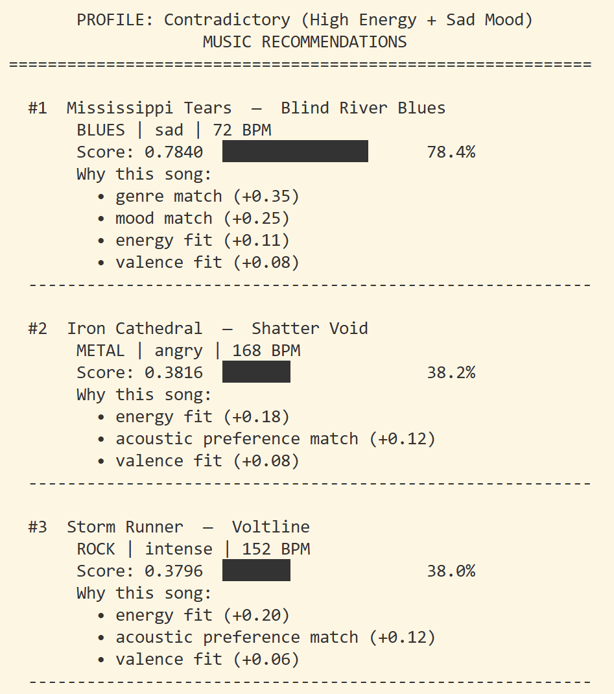
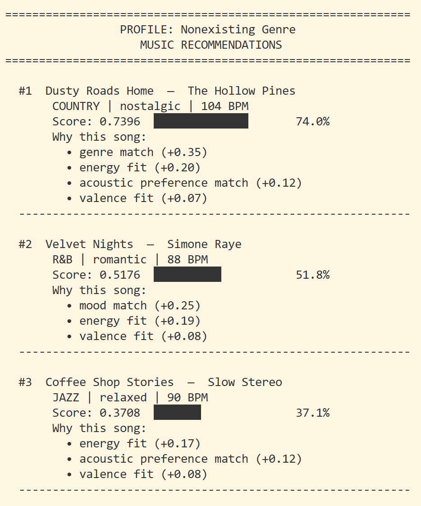

# 🎵 Music Recommender Simulation

## Project Summary

The main goal of my music recommender, FeelIt, is to get my listeners immersed in their music world by providing personal recommendations that matches their taste and mood. Thru user preferences set in user profiles, the recommender logic, takes that input, and returns to users songs, matching their preferences, by the percentages. Users may view reasons behind why the specific songs are recommended and have complete transparency on how the songs are scored for matches. The logic used for my recommender are relevant to existing recommender out there, which means it is also prone to biases and have flaws. Not every song recommendation may meet the expectation of the listeners but it is designed to bring music as close to the users' tastes as possible.

---

## How The System Works

Each song contains the following attributes: *title, artist, genre, mood, energy, tempo_bpm, valence, danceability, acousticness*

Using these user preferences, song recommendations will be made and personalized: *favorite_genre, favorite_mood, target_energy, likes_acoustic, target_valence, target_tempo*

How the music recommendation logic work is that, for all the songs recorded in the system, the recommender will first scan for matching favorite genre and mood. The list of song matches will be further refined through attributes like energy, valence, and acousticness. A descending ranked list of songs will be shared with user, based on their personal preferences through a set of scoring rules.

Here is a mermaid diagram of the music recommender logic:

flowchart TD
    
    A([User Profile\ngenre · mood · target_energy · likes_acoustic]) --> B

    B[Load songs from songs.csv] --> C{More songs\nto evaluate?}

    C -- Yes --> D[Get next song]

    D --> E1[genre_score\n1.0 if match else 0.0\n× 0.35]
    D --> E2[mood_score\n1.0 if match else 0.0\n× 0.25]
    D --> E3[energy_score\n1 - abs_user - song_\n× 0.20]
    D --> E4[acoustic_score\nacousticness if likes_acoustic\nelse 1 - acousticness\n× 0.12]
    D --> E5[valence_score\n1 - abs_derived - song_\n× 0.08]

    E1 & E2 & E3 & E4 & E5 --> F[Sum weighted scores\n→ final score 0.0–1.0]

    F --> G[(scored_songs\nrunning list)]
    G --> C

    C -- No more songs --> H[Sort scored_songs\nby score descending]
    H --> I[Take top K results]
    I --> J([Output\nTop K Recommendations\nwith scores + explanations])

    style A fill:#4A90D9,color:#fff
    style J fill:#27AE60,color:#fff
    style G fill:#8E44AD,color:#fff
    style F fill:#E67E22,color:#fff

**Algorithm Recipe**

- genre_score = 1.0  if song.genre == user.favorite_genre  else 0.0
- mood_score  = 1.0  if song.mood  == user.favorite_mood   else 0.0
- energy_score = 1 - |user.target_energy - song.energy|
- Threshold: acousticness >= 0.6 → "acoustic", < 0.6 → "non-acoustic"
- valence_score   = 1 - |user_valence - song.valence|
    -  mood_to_valence = { "happy": 0.8, "chill": 0.6, "focused": 0.55,   "relaxed": 0.65, "moody": 0.45, "intense": 0.5 }
    - user_valence    = mood_to_valence[user.favorite_mood]
- score = (genre_score   × 0.35)
      + (mood_score    × 0.25)
      + (energy_score  × 0.20)
      + (acoustic_score × 0.12)
      + (valence_score  × 0.08)

**Potential Biases**
- Genre and mood are binary matches, so if a user likes a genre or mood that is underrepresented in the catalog, they may get very few recommendations.
- Genre, being the most considered attribute, may override songs who are not matching the genre but closely matching with other attributes. 

---

## Getting Started

### Setup

1. Create a virtual environment (optional but recommended):

   ```bash
   python -m venv .venv
   source .venv/bin/activate      # Mac or Linux
   .venv\Scripts\activate         # Windows

2. Install dependencies

    ```bash
    pip install -r requirements.txt
    ```

3. Run the app:

    ```bash
    python -m src.main
    ```

### Running Tests

Run the starter tests with:

```bash
pytest
```

You can add more tests in `tests/test_recommender.py`.

---

## Experiments You Tried

Use this section to document the experiments you ran. For example:

- What happened when you changed the weight on genre from 2.0 to 0.5
- What happened when you added tempo or valence to the score
- How did your system behave for different types of users


---
- Test recommender logic by creating distinct, conflicting user profiles to see recommendation outcome
- Remove the 'Mood' attribute from the scoring formula completely, compare the song recommendations with/without
---

## Limitations and Risks

- Genre takes the bigger weight on whether a song is considered for recommendation
- Lyrics and language are not factors of consideration when chosing songs
- 
---

## Reflection

Read and complete `model_card.md`:

[**Model Card**](model_card.md)

Write 1 to 2 paragraphs here about what you learned:

- about how recommenders turn data into predictions
- about where bias or unfairness could show up in systems like this


---

## 7. `model_card_template.md`

Combines reflection and model card framing from the Module 3 guidance. :contentReference[oaicite:2]{index=2}  

```markdown
# 🎧 Model Card - Music Recommender Simulation

## 1. Model Name

Give your recommender a name, for example:

> FeelIt

---

## 2. Intended Use

> FeelIt mimicks how a simple version of existing recommendation systems function by suggesting 5 songs from a limited catalog using users' preferences stated on their profiles. It serves a learning purpose on understanding how recommendation logics and systems are built.
---

## 3. How It Works (Short Explanation)

Describe your scoring logic in plain language.

- What features of each song does it consider
- What information about the user does it use
- How does it turn those into a number

> For the scoring logic of songs, in the relevance of individual songs, the most important factors are the genre and mood. The related user preferences can retrieved from the user profiles, which is good for making the recommendations more personalized. Energy attribute is used for fine tuning the songs in their intensities(energy), referencing the 'target_energy' user sets. In support, acousticness and valence are used to score the song further. The algorithm identifies whether the user likes or not acoustic by setting a boolean on the user profiles (e.g. if user likes acoustics, the song will higher scores on acousticness will be considered). Valence would be used in support of genre/mood, when songs match in the previous attributes but give different feels. For each attribute used for scoring, we use slightly different scoring formulas. Attributes like genre and mood, because they are most heavily weighted, it is either yes or no (i.e. 0 or 35% for genre, same for mood). Similarly, for acousticness, with consideration of user's preference for acoustic, if the acousticness of a song passes a threshold, the song will either be considered or not. Lastly, for values like energy and valence, it is slightly more complex with comparisons between user preferene data and song data to calculate the score of how they match. The higher the value, the more the song should match the user's taste.

> Here are the song attribute weights: 
> - Genre: 35%
> - Mood: 25%
> - Energy: 20%
> - Acousticness: 12%
> - Valence: 8% 

>The following user info will be used: 
> - favorite genre
> - favorite mood
> - target energy
> - acoustic preference (boolean)

**Sample Music Recommendations**


---

## 4. Data

 The dataset contains 20 songs, with 4 genres (pop, rock, jazz, classical) and 4 moods (happy, sad, energetic, calm). Each song has attributes for energy, acousticness, and valence. The dataset is small and does not cover all possible genres or moods, which may limit the diversity of recommendations. Additionally, it does not include user listening history or other contextual factors that real recommendation systems often use.

---

## 5. Strengths

The system works well on finding songs for recommendation, even if the catalog lacks in the desired categories. It will recommend songs that matches the user preferences as much as possible and rank them based on their scores. For example, if a user has a strong preference for pop music and energetic mood, the system will prioritize songs that fit those criteria, even if there are only a few options available. Additionally, the system's use of multiple attributes (genre, mood, energy, acousticness, valence) allows it to capture a more nuanced understanding of user preferences and make recommendations that align with the user's overall taste.

---

## 6. Limitations and Bias

The system does not consider features such as artist popularity, release date, or user listening history, which are often important factors in real recommendation systems. This can lead to recommendations that may not align with a user's actual preferences or current trends. Additionally, the dataset is limited in terms of genres and moods, which may result in underrepresentation of certain music styles and emotional tones. The scoring system may also overfit to certain preferences, such as genre or mood, at the expense of other attributes like energy or acousticness, leading to less diverse recommendations. Finally, the system's reliance on explicit user preferences may unintentionally favor users who have more defined tastes or who are more familiar with their own preferences, while disadvantaging users who are more exploratory or less certain about their music tastes.

---

## 7. Evaluation

**Distinct and Conflicting User Profiles**
To test the recommender logic, I created 4 user profiles, which each test for a different scenario: default(common scenario), contradictory(high energy + sad mood), acoustic attribute flaw (there should be difference in recommendation if user had 0.1 float, instead of 0.9), and nonexisting genre (what happens if the genre + mood combo does not exist). Here are two of the user profiles: 

- Contradictory (High Energy + Sad Mood)
    

> This profiles tests contradicting energy and mood. As we only have one sad song in our songs data, this will test whether the this song will get pushed down on the rank list due to its low energy.

- Nonexisting Genre (Genre + Mood combo that does not exist)

> This profile tests the scenario where the user has a genre and mood combination that does not exist in the songs data. This will test whether the system can still provide recommendations based on other attributes like energy, acousticness, and valence.

In comparison, I ran a test that uses the same user profiles but removed the 'mood' attribute from consideration. The result was that the songs that relied on mood attribute for the matching, had much lower ranks than before. Especially when we consider user profiles with rare mood preferences, songs with the specific mood, does not land high on the recommendation list, compared to songs that have the favored gnere. 

---

## 8. Future Work

To improve the model, I would consider adding additional features such as artist popularity, release date, and user listening history to provide more context for the recommendations. This would allow the system to make more informed suggestions based on a user's past behavior and current trends in music. I can also add an option to the recommendation list where if user want to explore music much more diverse, the recommendations would return unranked, but in a randomized manner.

---

## 9. Personal Reflection

Through this project, I learned about the various factors that go into building a music recommendation system and how different attributes can be weighted to create personalized recommendations. I found it interesting how even a simple model can capture some aspects of user preferences, but also how it can fall short with the limited information. This experience has made me more aware of the complexities behind music recommendation algorithms and the importance of finding the balance between different attributes to provide diverse, yet relevant suggestions to users. An even broader realization is that, even though the data used by the recommender logic is summarized to numerical values, these data were sourced from human users. Hence, how 'smart' a recommender can become relies on the information the users provides it, proving the neccessity of human input for these systems.
