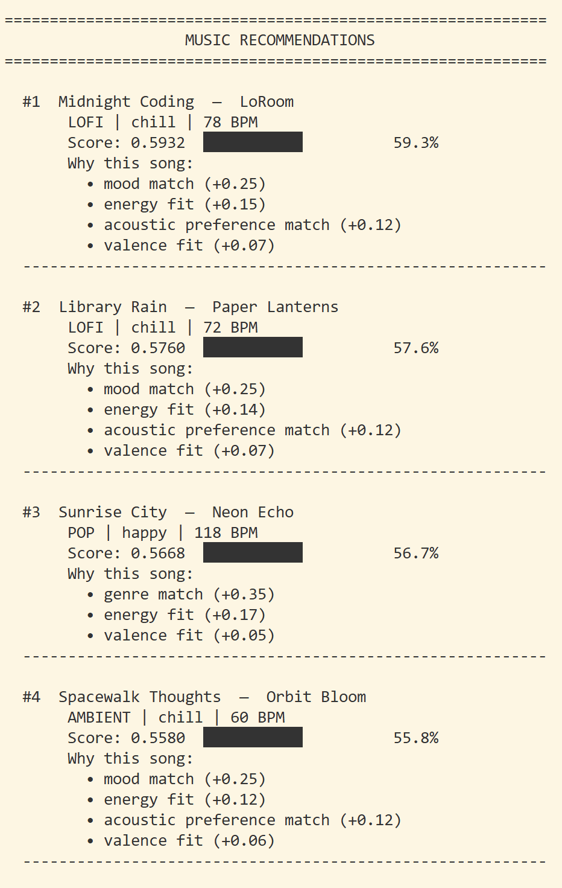
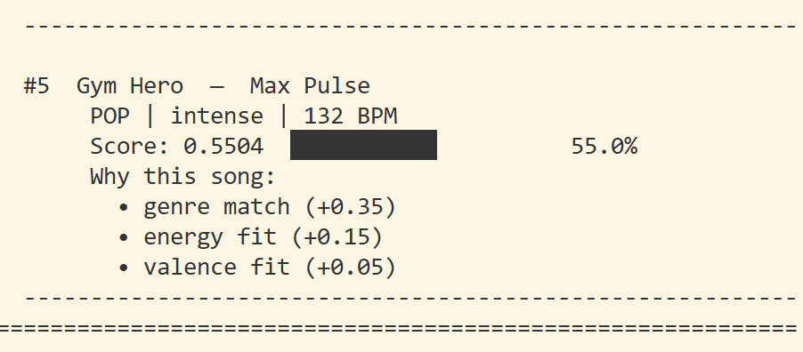

# 🎧 Model Card: Music Recommender Simulation

## 1. Model Name  

FeelIt

---

## 2. Intended Use  

FeelIt mimicks how a simple version of existing recommendation systems function by suggesting 5 songs from a limited catalog using users' preferences stated on their profiles. It serves a learning purpose on understanding how recommendation logics and systems are built.

---

## 3. How the Model Works  

For the scoring logic of songs, in the relevance of individual songs, the most important factors are the genre and mood. The related user preferences can retrieved from the user profiles, which is good for making the recommendations more personalized. Energy attribute is used for fine tuning the songs in their intensities(energy), referencing the 'target_energy' user sets. In support, acousticness and valence are used to score the song further. The algorithm identifies whether the user likes or not acoustic by setting a boolean on the user profiles (e.g. if user likes acoustics, the song will higher scores on acousticness will be considered). Valence would be used in support of genre/mood, when songs match in the previous attributes but give different feels. For each attribute used for scoring, we use slightly different scoring formulas. Attributes like genre and mood, because they are most heavily weighted, it is either yes or no (i.e. 0 or 35% for genre, same for mood). Similarly, for acousticness, with consideration of user's preference for acoustic, if the acousticness of a song passes a threshold, the song will either be considered or not. Lastly, for values like energy and valence, it is slightly more complex with comparisons between user preferene data and song data to calculate the score of how they match. The higher the value, the more the song should match the user's taste.

> Here are the song attribute weights: 
> - Genre: 35%
> - Mood: 25%
> - Energy: 20%
> - Acousticness: 12%
> - Valence: 8% 

>The following user info will be used: 
> - favorite genre
> - favorite mood
> - target energy
> - acoustic preference (boolean)

**Sample Music Recommendations**

---

## 4. Data  

    The dataset contains 20 songs, with 4 genres (pop, rock, jazz, classical) and 4 moods (happy, sad, energetic, calm). Each song has attributes for energy, acousticness, and valence. The dataset is small and does not cover all possible genres or moods, which may limit the diversity of recommendations. Additionally, it does not include user listening history or other contextual factors that real recommendation systems often use.
---

## 5. Strengths   

The system works well on finding songs for recommendation, even if the catalog lacks in the desired categories. It will recommend songs that matches the user preferences as much as possible and rank them based on their scores. For example, if a user has a strong preference for pop music and energetic mood, the system will prioritize songs that fit those criteria, even if there are only a few options available. Additionally, the system's use of multiple attributes (genre, mood, energy, acousticness, valence) allows it to capture a more nuanced understanding of user preferences and make recommendations that align with the user's overall taste.

---

## 6. Limitations and Bias 

The system does not consider features such as artist popularity, release date, or user listening history, which are often important factors in real recommendation systems. This can lead to recommendations that may not align with a user's actual preferences or current trends. Additionally, the dataset is limited in terms of genres and moods, which may result in underrepresentation of certain music styles and emotional tones. The scoring system may also overfit to certain preferences, such as genre or mood, at the expense of other attributes like energy or acousticness, leading to less diverse recommendations. Finally, the system's reliance on explicit user preferences may unintentionally favor users who have more defined tastes or who are more familiar with their own preferences, while disadvantaging users who are more exploratory or less certain about their music tastes.

---

## 7. Evaluation  

To test the recommender logic, I created 4 user profiles, which each test for a different scenario: default(common scenario), contradictory(high energy + sad mood), acoustic attribute flaw (there should be difference in recommendation if user had 0.1 float, instead of 0.9), and nonexisting genre (what happens if the genre + mood combo does not exist)

In the tests, I looked for what songs were recommended and why they were chosen. In comparison, I ran a test that uses the same user profiles but removed the 'mood' attribute from consideration. The result was that the songs that relied on mood attribute for the matching, had much lower ranks than before. Especially when we consider user profiles with rare mood preferences, songs with the specific mood, does not land high on the recommendation list, compared to songs that have the favored gnere. 
---

## 8. Future Work  

To improve the model, I would consider adding additional features such as artist popularity, release date, and user listening history to provide more context for the recommendations. This would allow the system to make more informed suggestions based on a user's past behavior and current trends in music. I can also add an option to the recommendation list where if user want to explore music much more diverse, the recommendations would return unranked, but in a randomized manner.

---

## 9. Personal Reflection  

Through this project, I learned about the various factors that go into building a music recommendation system and how different attributes can be weighted to create personalized recommendations. I found it interesting how even a simple model can capture some aspects of user preferences, but also how it can fall short with the limited information. This experience has made me more aware of the complexities behind music recommendation algorithms and the importance of finding the balance between different attributes to provide diverse, yet relevant suggestions to users.